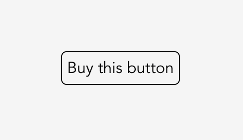

# Button
Vite + Vue3 + Stripe client only example. It's a button that lets you buy this free code for a dollar, [see it live](https://barakbinyamin.github.io/Button/)

<p style="text-align:center" align="center">
  <a href="https://barakbinyamin.github.io/Button/">
    
  </a>
</p>

## Quickstart
1. (5-10 minutes) [Fork this repo](https://github.com/BarakBinyamin/Button/fork), [enable git pages](https://docs.github.com/en/pages/quickstart) for the main branch docs folder
2. (10-20 minutes) [Create a stripe account](https://stripe.com/), [Enable client only checkout](https://stripe.com/docs/payments/checkout/client#enable-checkout) (add your domain like **example.github.io**), collect [your public and private api keys](https://dashboard.stripe.com/apikeys)
3. (1 minute) Run the follwing code which adds a product to your stripe account and rebuilds the website with your public api key and product_id
```bash
git clone YOUR-FORK-URL && cd button
npm install
node quickstart.js --publickey PUBLIC_APIKEY --privatekey PRIVATE_APIKEY
git commit -m "Let's make some money" && git push
```

### Docker
```bash
git clone YOUR-FORK-URL && cd button
docker build --tag button .
docker run -it  -v $PWD/docs:/button/docs button --publickey PUBLIC_APIKEY --privatekey PRIVATE_APIKEY
git commit -m "Let's make some money" && git push
```

## Resources
- [Vue](https://vuejs.org/)
- [Vite](https://vitejs.dev/guide/)
- [Stripe](https://stripe.com/)
- [Nodejs](https://nodejs.org/en)
- [Stripe API](https://stripe.com/docs/api)
- [Stripe API Keys](https://stripe.com/docs/keys)
- [Vue Stripe Library](https://vuestripe.com/)
- [Stripe testing info](https://stripe.com/docs/testing)
- [Stripe checkout logo](https://dashboard.stripe.com/settings/branding)
- [Checkout Stripe payouts](https://dashboard.stripe.com/balance/overview)
- [Software liscense brochure](https://choosealicense.com/licenses/)
- [Vite environment variables](https://vitejs.dev/guide/env-and-mode.html)
- [Vite change build directory](https://stackoverflow.com/questions/66863200/changing-the-input-and-output-directory-in-vite)
- [Access URL query paramaters](https://stackoverflow.com/questions/35914069/how-can-i-get-query-parameters-from-a-url-in-vue-js)
- [Access url properties using javascript](https://stackoverflow.com/questions/11401897/get-the-current-domain-name-with-javascript-not-the-path-etc)


